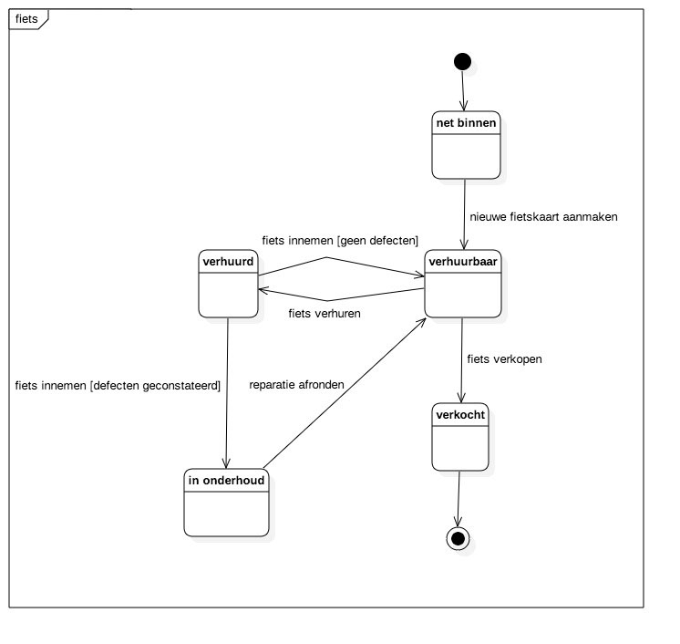
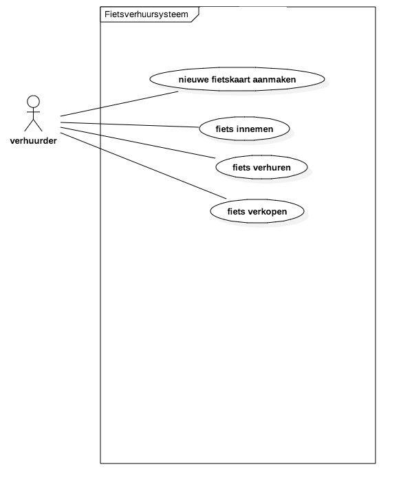

# AUI-Polymer

Door Karim Stekelenburg en Dahir Warsame

## Case

‘Op Fietse’ is een ouderwets recreatie bedrijf (eenmanszaak) dat o.a. fietsen verhuurt.
Elk jaar koopt het bedrijf een aantal nieuwe fietsen. Zodra deze geleverd zijn, wordt elke fiets op
het frame voorzien van een uniek verhuur nummer, en wordt er een papieren fietskaart voor in
de kaartenbak aangemaakt.
Op de fietskaart wordt de datum waarop de fiets is binnengekomen, de inkoopprijs en het
toegekende fietsnummer vermeld.
Als een klant vervolgens een fiets wil huren wordt er voor deze klant een verhuurkaart
aangemaakt waarop de naam, het mobiele nummer en het nummer van of het paspoort of het
rijbewijs van de klant wordt vermeld, alsmede de dag en het tijdstip van de verhuur. De
fietsenkaarten van de fietsen die door deze klant worden gehuurd plus de klantkaart worden
vervolgens met een paperclip samengevoegd en in bakje “verhuurd” gelegd.
Op het moment dat de klant de gehuurde fietsen terug brengt worden de fietskaarten
teruggelegd in bakje “verhuurbaar” en wordt de verhuurkaart voor de boekhouding in een map
bewaard.
Mocht een fiets een mankement hebben, dan wordt de fietskaart van die fiets in een bakje
onderhoud gelegd, van waaruit die weer naar het bakje verhuurbaar verhuisd zodra de fiets is
gerepareerd.
Als een fiets is afgeschreven, dan wordt op de fietskaart vermeld dat deze aan klanten verkocht
mag worden en wordt er de datum bij genoteerd vanaf wanneer de fiets in de verkoop is
gegaan. Aan het einde van het kalenderjaar worden alle fietsen die minimaal 9 maanden in de
verkoop staan als één partij geveild aan een groep opkopers, op die manier verdwijnt de fiets
definitief uit het bestand van het recreatiebedrijf en worden de fietskaarten van de verkochte
fietsen vernietigd.

## UML Diagrams

### Toestandsdiagram: Fiets

### Use Case Diagram

### Usecase template

## Volledigheidscheck

### Usecase Diagram

| Actor (actors) | Usecase name        |
| -------------- | ------------------- |
| Verhuurder     | Fietskaart aanmaken |
| Verhuurder     | Fiets innemen       |
| Verhuurder     | Fiets vehuren       |
| Verhuurder     | Fiets verkopen      |
| Verhuurder     | Reparatie afronden  |

### Toestandsdiagram

| Toestand van | Toestand naar | Actor      | Beschrijving                             |
| ------------ | ------------- | ---------- | ---------------------------------------- |
| start        | net binnen    | verhuurder | de actor ontvangt de fiets.              |
| net binnen   | verhuurbaar   | verhuurder | de actor maakt een nieuwe fietskaart aan in het systeem met de status 'verhuurbaar'. |
| verhuurbaar  | verhuurd      | verhuurder | de actor verhuurt de fiets aan de huurder en zet in het systeem de status van de fiets op 'verhuurt'. |
| verhuurd     | verhuurbaar   | verhuurder | de actor zet in het systeem de status van de fiets op 'verhuurbaar'. |
| verhuurd     | in onderhoud  | verhuurder | de actor zet in het systeem de status van de fiets op 'in onderhoud'. |
| in onderhoud | verhuurbaar   | verhuurder | de actor zet in het systeem de status van de fiets op 'verhuurbaar'. |
| verhuurbaar  | verkocht      | verhuurder | de actor verwijdert de fiets uit het systeem. |

### Use Case samenvatting/template

|      Use Case       | Samenvatting                             |
| :-----------------: | ---------------------------------------- |
| fietskaart aanmaken | wanneer er een nieuwe fiets binnenkomt, maakt de actor een registratie in het systeem van de nieuwe fiets. in deze registratie vermeld de actor de kleur van de fiets, word de status op 'verhuurbaar' gezet en wijst het systeem automatisch een uniek nummer aan de fiets toe. |
|    fiets innemen    | wanneer een huurder de fiets inlevert, kijkt de actor of de fiets defecten heeft. als dit zo is word de status van de fiets in het systeem op 'in onderhoud' gezet. als de fiets geen defecten heeft word de status van de fiets op 'verhuurbaar' gezet. |
|   fiets verhuren    | wanneer een fiets word verhuurt, zet de actor de status van de fiets in het systeem op 'verhuurt'. |
|   fiets verkopen    | wanneer een fiets word verkocht, verwijdert de actor de fiets uit het systeem. |
